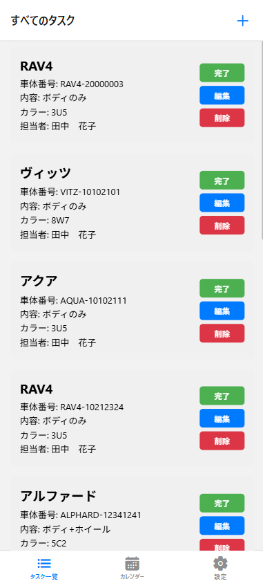
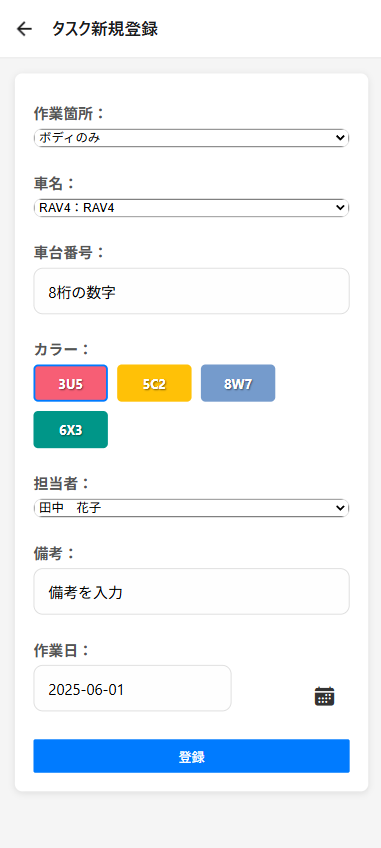
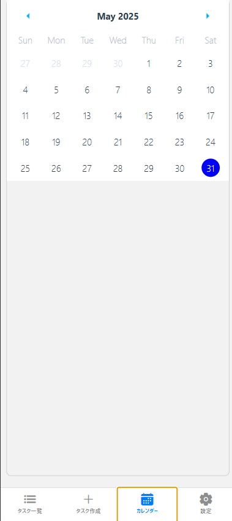

 Laravel + React Native (Expo) タスク管理アプリ (ローカル開発用)

このプロジェクトは、バックエンドにLaravel API、フロントエンドにReact Native (Expo) を使用して構築されたモバイルタスク管理アプリケーションです。車両関連のタスク管理に特化しており、カレンダー表示、タスク一覧、および新規タスク登録機能を備えています。

本READMEは、**ローカル環境でのみ**アプリケーションをセットアップし、動作させるための手順を説明します。

## 🌐 アプリケーションの概要

このアプリケーションは、車両に関連するタスクを効率的に管理するためのモバイルアプリです。
Laravel (API) をバックエンドに、React Native (Expo) をフロントエンドに採用し、クロスプラットフォームでの開発を行っています。
Docker (Laravel Sail) を利用して、開発環境を構築しています。

## ✨ 主要機能

* **タスクのカレンダー表示:**
    * カレンダーにタスクがある日付をマーク
    * 縦方向スクロールで月の切り替えが可能
* **タスク一覧表示:**
    * タスクの詳細情報をリストで表示
    * アイテムタップで選択状態を切り替え
* **タスクの新規作成:**
    * 作業箇所、車名、車台番号、カラー、担当者、作業日、備考などを入力してタスクを登録
* **ナビゲーション:**
    * Expo Router によるタブベースのナビゲーション（カレンダー、タスク一覧、設定、タスク作成）
* **API連携:**
    * タスクデータの取得、登録など、すべてのデータ操作をRESTful API経由で行います
* **（今後の実装予定）** タスクの詳細表示、編集、完了、削除
* **（今後の実装予定）** ログイン機能、車種管理機能

画面イメージ
<table style="width:100%; border-collapse: collapse;">
  <tr>
    <td style="width:34%; text-align:center; vertical-align:top; padding:10px;">
      <h3>タスク一覧画面</h3>
      
    </td>
    <td style="width:33%; text-align:center; vertical-align:top; padding:10px;">
      <h3>タスク新規作成画面</h3>
      
    </td>
    <td style="width:33%; text-align:center; vertical-align:top; padding:10px;">
      <h3>タスクカレンダー画面</h3>
      
    </td>
  </tr>
</table>

## 🛠️ 主要技術スタックとバージョン

このプロジェクトでは以下の主要技術を使用しています。

### フロントエンド (React Native / Expo)

* **React Native:** `0.79.2`
* **React:** `19.0.0`
* **Expo SDK:** `~53.0.9`
* **Expo Router:** `~5.0.6`
* **主なライブラリ:**
    * `axios`: `^1.9.0`
    * `react-native-calendars`: `^1.1312.0`
    * `@react-native-community/datetimepicker`: `^8.4.1`
    * `@react-native-picker/picker`: `^2.11.0`
    * `@expo/vector-icons`: `^14.1.0`
    * `@react-navigation/native`: `^7.1.6`
    * `@react-navigation/bottom-tabs`: `^7.3.10`
    * `react-native-safe-area-context`: `5.4.0`
    * (その他の依存関係は [todo-expo-app/package.json](https://github.com/motoki0805/todo-expo-app/blob/main/package.json) を参照してください。)

### バックエンド (Laravel / PHP / MySQL)

* **Laravel Framework:** `9.19.x`
* **PHP:** `8.1.x` (Laravel SailのDockerイメージより)
* **MySQL:** `8.0.x` (Docker Composeファイルより)
* **主なライブラリ:**
    * `laravel/sanctum`: `^3.0`
    * `barryvdh/laravel-dompdf`: `^2.0`
    * (その他の依存関係は [todo/composer.json](https://github.com/motoki0805/todo/blob/main/composer.json) を参照してください。)

## 🚀 ローカルでのセットアップ

### 前提条件

* Docker Desktop がインストールされていること (Laravel Sail用)
* Node.js (LTS推奨) および npm (または yarn) がインストールされていること
* Expo CLI (`npm install -g expo-cli` または `npx expo install expo-cli`) がインストールされていること

### 1. バックエンド (Laravel API) のセットアップ

1.  **プロジェクトをクローンし、ディレクトリに移動:**
    ```bash
    git clone [https://github.com/motoki0805/todo.git](https://github.com/motoki0805/todo.git) todo-laravel
    cd todo-laravel # Laravelプロジェクトのルートディレクトリに移動
    ```
    (もし `src` ディレクトリがLaravelプロジェクトのルートであれば `cd todo-laravel/src` )

2.  **.env ファイルの作成と設定:**
    `.env.example` をコピーして `.env` ファイルを作成し、必要な環境変数を設定します。特にデータベース接続情報を確認してください。
    ```bash
    cp .env.example .env
    ```
    * `APP_NAME=Laravel` 
    * `APP_ENV=local`
    * `APP_KEY=base64:...`
    * `APP_DEBUG=true`
    * `APP_URL=http://localhost`
    * `DB_CONNECTION=mysql`
    * `DB_HOST=mysql`
    * `DB_PORT=3306`
    * `DB_DATABASE=laravel` 
    * `DB_USERNAME=sail` 
    * `DB_PASSWORD=password` 
    * (その他の環境変数も必要に応じて設定してください。)

3.  **Composerの依存関係インストールとSailの起動:**
    ```bash
    docker run --rm \
        -u "<span class="math-inline">\(id \-u\)\:</span>(id -g)" \
        -v "$(pwd):/var/www/html" \
        -w /var/www/html \
        laravelsail/php81-composer:latest \
        composer install --ignore-platform-reqs

    ./vendor/bin/sail up -d
    ```

4.  **データベースのマイグレーションとシーディング:**
    ```bash
    ./vendor/bin/sail artisan migrate
    ./vendor/bin/sail artisan db:seed # テストデータが必要な場合
    ```

5.  **Laravel開発サーバーの確認:**
    Webブラウザで `http://localhost/login` にアクセスし、ログインページが表示されることを確認してください。

### 2. フロントエンド (React Native Expo) のセットアップ

1.  **React Nativeプロジェクトのルートディレクトリに移動:**
    ```bash
    git clone [https://github.com/motoki0805/todo-expo-app.git](https://github.com/motoki0805/todo-expo-app.git) todo-expo-app
    cd todo-expo-app # Expoプロジェクトのルートディレクトリに移動
    ```
    (もしLaravelプロジェクトと同じディレクトリにあるなら、`cd ../todo-expo-app` のように移動)

2.  **npm (または yarn) の依存関係インストール:**
    ```bash
    npm install
    # または yarn install
    ```
    * 必要なExpoおよびReact Nativeライブラリがインストールされることを確認

3.  **Expo Routerに必要なファイル (`app/_layout.tsx`, `app/(tabs)/TaskListScreen.tsx` など) が存在することを確認**

## ▶️ アプリケーションの実行

上記「ローカルでのセットアップ」が完了したら、以下の手順でアプリを起動できます。

1.  **React Nativeアプリの `API_BASE_URL` を設定:**
    `todo-expo-app/src/hooks/useTasks.ts` ファイルを開き、`API_BASE_URL` 定数を、ローカルのLaravel Sailが公開しているアドレス (`http://localhost/api`) に設定します。

    ```typescript
    // todo-expo-app/src/hooks/useTasks.ts

    // ★ローカル接続用 (外部公開しません) ★
    export const API_BASE_URL = "http://localhost/api";
    ```
    **重要:**
    * これはホストOSの80番ポートにマップされたLaravel SailのWebサーバーへのアクセスです。
    * **Androidエミュレータや実機（物理デバイス）で動作させる場合**、`http://localhost` はエミュレータ/実機自身の `localhost` を参照してしまうため、ホストPCのLaravelに接続できません。
        * この場合、`API_BASE_URL` を **ホストPCのローカルIPアドレス** （例: `http://192.168.1.5/api`）に設定する必要があります。ホストPCのIPアドレスはコマンドプロンプトで `ipconfig` (Windows) または `ifconfig`/`ip addr` (Linux/macOS) で確認できます。
        * または、Androidエミュレータの特別なエイリアスである `http://10.0.2.2/api` を使用することもできます。

2.  **Expoアプリを起動し、キャッシュをクリアする:**
    ```bash
    npx expo start --clear
    ```

3.  **スマートフォンまたはエミュレータでExpo Goアプリを開き、QRコードをスキャンしてアプリを起動する。**
    * アプリが起動し、Laravel APIからデータが正常に表示されるはずです。

## 💡 今後の展望・改善点

* タスクの詳細表示、編集、完了、削除機能の実装
* 認証（ログイン・ユーザー管理）機能の追加
* 車種管理機能の実装
* より詳細なエラーハンドリングとUIフィードバックの強化
* テストコードの追加
* CI/CD (継続的インテグレーション/継続的デプロイ) の導入
* 本番環境へのデプロイ (AWS EC2/RDSなど)
* **ngrok を使用した一時的なインターネット公開** (必要に応じてこの項目を復活させ、手順を追記してください)
