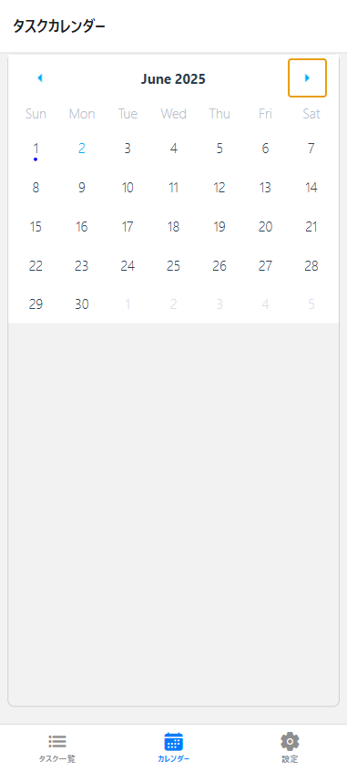

 Laravel + React Native (Expo) タスク管理アプリ (ローカル開発用)

このプロジェクトは、バックエンドにLaravel API、フロントエンドにReact Native (Expo) を使用して構築されたモバイルタスク管理アプリケーションです。車両関連のタスク管理に特化しており、カレンダー表示、タスク一覧、および新規タスク登録機能を備えています。

本READMEは、**ローカル環境でのみ**アプリケーションをセットアップし、動作させるための手順を説明します。

## 🌐 アプリケーションの概要

このアプリケーションは、車両に関連するタスクを効率的に管理するためのモバイルアプリです。
Laravel (API) をバックエンドに、React Native (Expo) をフロントエンドに採用し、クロスプラットフォームでの開発を行っています。
Docker (Laravel Sail) を利用して、開発環境を構築しています。

## ✨ 主要機能

* **タスクのカレンダー表示:**
    * カレンダーにタスクがある日付をマーク
    * 縦方向スクロールで月の切り替えが可能
* **タスク一覧表示:**
    * タスクの詳細情報をリストで表示
    * アイテムタップで選択状態を切り替え
* **タスクの新規作成:**
    * 作業箇所、車名、車台番号、カラー、担当者、作業日、備考などを入力してタスクを登録
* **ナビゲーション:**
    * Expo Router によるタブベースのナビゲーション（カレンダー、タスク一覧、設定）
* **API連携:**
    * タスクデータの取得、登録など、すべてのデータ操作をRESTful API経由で行います
* **（今後の実装予定）** タスクの詳細表示
* **（今後の実装予定）** ログイン機能、車種管理機能

画面イメージ
<table style="width:100%; border-collapse: collapse;">
  <tr>
    <td style="width:34%; text-align:center; vertical-align:top; padding:10px;">
      <h3>タスク一覧画面</h3>
      
    </td>
    <td style="width:33%; text-align:center; vertical-align:top; padding:10px;">
      <h3>タスク新規作成画面</h3>
      
    </td>
    <td style="width:33%; text-align:center; vertical-align:top; padding:10px;">
      <h3>タスクカレンダー画面</h3>
      
    </td>
  </tr>
</table>

## 🛠️ 主要技術スタックとバージョン

このプロジェクトでは以下の主要技術を使用しています。

### フロントエンド (React Native / Expo)

* **React Native:** `0.79.2`
* **React:** `19.0.0`
* **Expo SDK:** `~53.0.9`
* **Expo Router:** `~5.0.6`
* **主なライブラリ:**
    * `axios`: `^1.9.0`
    * `react-native-calendars`: `^1.1312.0`
    * `@react-native-community/datetimepicker`: `^8.4.1`
    * `@react-native-picker/picker`: `^2.11.0`
    * `@expo/vector-icons`: `^14.1.0`
    * `@react-navigation/native`: `^7.1.6`
    * `@react-navigation/bottom-tabs`: `^7.3.10`
    * `react-native-safe-area-context`: `5.4.0`
    * (その他の依存関係は [todo-expo-app/package.json](https://github.com/motoki0805/todo-expo-app/blob/main/package.json) を参照してください。)

### バックエンド (Laravel / PHP / MySQL)

* **Laravel Framework:** `9.19`
* **PHP:** `8.1` 
* **MySQL:** `8.0`
* **主なライブラリ:**
    * `laravel/sanctum`: `^3.0`
    * `barryvdh/laravel-dompdf`: `^2.0`
    * (その他の依存関係は [todo/composer.json](https://github.com/motoki0805/todo/blob/main/composer.json) を参照してください。)

## 💡 今後の展望・改善点

* タスクの詳細表示機能の実装
* カレンダーからのタスク操作の追加
* 認証（ログイン・ユーザー管理）機能の追加
* 車種管理機能の実装
* より詳細なエラーハンドリングとUIフィードバックの強化
* テストコードの追加
* CI/CD の導入
* 本番環境へのデプロイ (AWS EC2)
